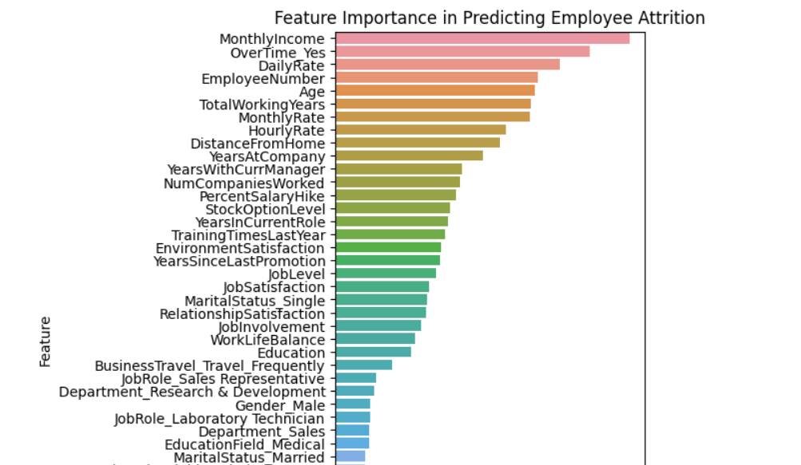

# Analysis on Attrition

it is one of the important factor for company and employee both. I created one ML model based on dataset in Kaggle and performed analysis to understand the factors. Below is output graph.

X axis : imporantce divided in 4 quarter like 0.02, 0.04, 0.06 and 0.08
Y axis : factor of change

